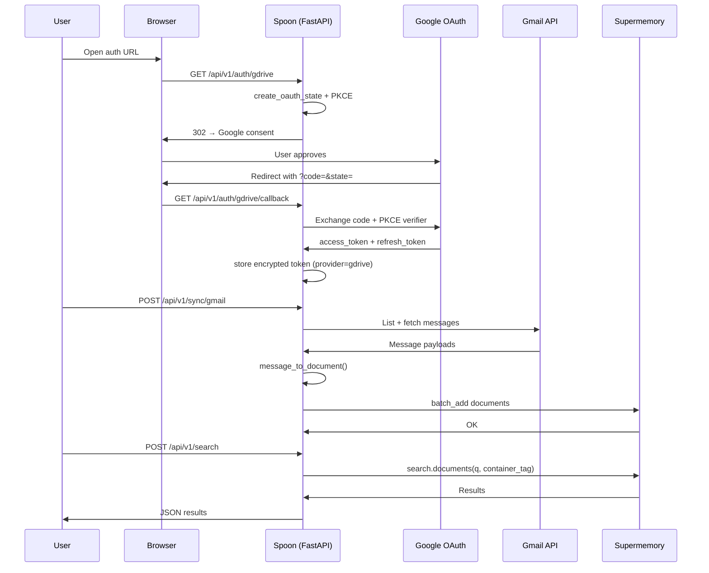

# Spoon End-to-End Walkthrough

This guide walks through a **complete real-world flow**: connect Gmail (via Google OAuth), sync emails into Supermemory, search them, and disconnect. The same pattern applies to every OAuth provider; Gmail is used because it shares Google credentials with Google Drive and shows incremental sync limits.

---

## What you will learn

| Step | What happens | Key modules |
| --- | --- | --- |
| 1 | Start the server | `main.py`, `config.py` |
| 2 | Authenticate API calls | `core/security.py` |
| 3 | Begin OAuth | `routes.py`, `auth/providers.py`, `auth/gdrive_oauth.py`, `auth/state.py`, `auth/pkce.py` |
| 4 | Complete OAuth callback | `auth/store.py`, `auth/token_utils.py` |
| 5 | Run sync | `connectors/registry.py`, `connectors/gmail.py`, `connectors/base.py` |
| 6 | Ingest to Supermemory | `supermemory/ingest.py`, `supermemory/client.py` |
| 7 | Search | `supermemory/search.py`, `models.py` |
| 8 | Disconnect | `routes.py`, `auth/store.py` |

---

## Prerequisites

Copy environment template and fill required values:

```bash
cp .env.example .env
```

Minimum for this walkthrough:

| Variable | Example | Why |
| --- | --- | --- |
| `SPOON_SUPERMEMORY_API_KEY` | `sm_...` | Upload and search documents |
| `SPOON_API_KEY` | `dev-secret-key` | Protects all endpoints except `/health` |
| `SPOON_CONTAINER_TAG` | `my-workspace` | Groups documents in Supermemory |
| `SPOON_GDRIVE_CLIENT_ID` | Google OAuth client ID | Gmail uses Google OAuth |
| `SPOON_GDRIVE_CLIENT_SECRET` | Google OAuth secret | Token exchange |
| `SPOON_APP_URL` | `http://localhost:8000` | OAuth redirect URI base |

Start the server:

```bash
uvicorn app.main:app --reload --port 8000
```

---

## Architecture overview



---

## Step 1 — Health check (no API key)

Public endpoint; confirms the process is running.

```bash
curl -s http://localhost:8000/api/v1/health | jq
```

**Expected response:**

```json
{
  "status": "ok"
}
```

**What the code does:**

1. Request hits `main.py` → middleware chain → `routes.py`.
2. `GET /health` has **no** `require_api_key` dependency — intentionally public for load balancers and Docker healthchecks.
3. Returns `HealthResponse` from `models.py`.

---

## Step 2 — List providers (API key required)

```bash
curl -s http://localhost:8000/api/v1/providers \
  -H "X-API-Key: dev-secret-key" | jq
```

**Expected response:**

```json
{
  "providers": ["notion", "linear", "gdrive", "gmail", "outlook", "slack"]
}
```

**What the code does:**

| Layer | File | Behavior |
| --- | --- | --- |
| Middleware | `core/security.py` | `RateLimitMiddleware` checks path limits |
| Auth | `core/security.py` | `require_api_key` compares header to `SPOON_API_KEY` |
| Handler | `routes.py` | Returns `SUPPORTED_PROVIDERS` from `connectors/registry.py` |

If `SPOON_API_KEY` is **unset**, auth is skipped (dev mode). In production, always set it.

---

## Step 3 — Start OAuth (Google / Gmail)

Gmail does **not** have its own OAuth flow. It reuses the Google Drive OAuth token stored under provider `"gdrive"`.

Open in a browser (or curl with `-L` to follow redirects):

```bash
curl -s -o /dev/null -w "%{redirect_url}\n" \
  -H "X-API-Key: dev-secret-key" \
  http://localhost:8000/api/v1/auth/gdrive
```

You get a Google consent URL. Sign in and approve **Drive + Gmail** scopes.

### Behind the scenes

```
GET /api/v1/auth/gdrive
```

| Step | Module | Detail |
| --- | --- | --- |
| 1 | `routes.py` | Looks up `OAUTH_PROVIDERS["gdrive"]` in `auth/providers.py` |
| 2 | `auth/gdrive_oauth.py` | `build_authorization_url()` builds Google URL with scopes |
| 3 | `auth/pkce.py` | Generates `code_verifier` + S256 `code_challenge` |
| 4 | `auth/state.py` | Stores `{state, pkce_verifier, created_at}` in memory or Redis |
| 5 | Response | `302 Redirect` to `accounts.google.com` |

**Why PKCE?** Public clients (or server apps without client secret protection) benefit from proof-of-possession during token exchange. Spoon stores the verifier server-side and sends it only at callback time.

**Why state?** Prevents CSRF: an attacker cannot trick your browser into connecting their Google account to your Spoon instance without knowing the random `state` value.

---

## Step 4 — OAuth callback

Google redirects the browser to:

```
GET /api/v1/auth/gdrive/callback?code=...&state=...
```

You normally complete this in the browser. With curl (after copying query params from the redirect URL):

```bash
curl -s "http://localhost:8000/api/v1/auth/gdrive/callback?code=AUTH_CODE&state=STATE_VALUE" \
  -H "X-API-Key: dev-secret-key" | jq
```

**Expected response:**

```json
{
  "status": "ok",
  "message": "Google Drive connected. Gmail sync uses the same token."
}
```

### Token storage flow

| Step | Module | Detail |
| --- | --- | --- |
| 1 | `routes.py` | `pop_oauth_state(state)` — one-time use, TTL enforced |
| 2 | `auth/gdrive_oauth.py` | `exchange_code_for_token(code, pkce_verifier=...)` |
| 3 | `auth/token_utils.py` | `merge_oauth_token()` preserves existing `refresh_token` if Google omits it |
| 4 | `auth/store.py` | Atomic write to `~/.spoon/tokens.json`, mode `0600`, optional Fernet encryption |
| 5 | `logging.py` | `log_audit("oauth_connect", provider="gdrive")` |

**Inspect token file (local dev):**

```bash
ls -la ~/.spoon/tokens.json   # permissions should be -rw-------
```

---

## Step 5 — Sync Gmail

```bash
curl -s -X POST http://localhost:8000/api/v1/sync/gmail \
  -H "X-API-Key: dev-secret-key" | jq
```

**Example response:**

```json
{
  "provider": "gmail",
  "documents_processed": 142,
  "errors": []
}
```

### Sync pipeline (detailed)

```
POST /api/v1/sync/gmail
        │
        ▼
routes._run_sync("gmail")
        │
        ├── registry.get_connector("gmail") → GmailConnector()
        ├── connector.is_authenticated()
        │     └── get_provider_token("gdrive") OR service account
        └── connector.sync()
```

#### Inside `GmailConnector.sync()` (`connectors/gmail.py`)

| Phase | What happens |
| --- | --- |
| **Auth** | `refresh_gdrive_token_if_needed()` — refreshes if near expiry |
| **List** | `users/me/messages?q=in:anywhere -in:spam -in:trash` (+ `after:` if `SPOON_SYNC_SINCE_DAYS` set) |
| **Fetch** | For each message ID, `GET users/me/messages/{id}?format=full` |
| **Parse** | `_extract_body()` walks MIME tree; prefers plain text, falls back to `html_to_text()` |
| **Normalize** | `message_to_document()` → `Document(id="gmail-{id}", source="gmail", ...)` |
| **Limit** | `upload_document_batch()` respects `SPOON_MAX_DOCUMENTS_PER_SYNC` |
| **Upload** | `supermemory/ingest.upload_documents()` in batches of 20 |

#### Example normalized document

Before upload, a single email becomes:

| Field | Example value |
| --- | --- |
| `id` | `gmail-18f3a2b1c4d5e6f7` |
| `source` | `gmail` |
| `title` | `Re: Q3 planning` |
| `content` | Subject, From, To, Date, body text (truncated to `max_content_length`) |
| `url` | `https://mail.google.com/mail/u/0/#inbox/18f3a2b1c4d5e6f7` |
| `metadata` | `thread_id`, `label_ids`, `internal_date`, etc. |

#### Supermemory ingest (`supermemory/ingest.py`)

| Step | Detail |
| --- | --- |
| `_sanitize_custom_id(doc.id)` | SHA-256 hash + safe prefix — avoids invalid IDs and limits PII in IDs |
| `_build_metadata(doc)` | Flattens metadata to str/int/float/bool for Supermemory |
| `client.documents.batch_add()` | Up to 20 documents per API call |
| `container_tag` | From `SPOON_CONTAINER_TAG` — scopes search to your workspace |

---

## Step 6 — Search synced content

```bash
curl -s -X POST http://localhost:8000/api/v1/search \
  -H "X-API-Key: dev-secret-key" \
  -H "Content-Type: application/json" \
  -d '{"query": "Q3 planning budget", "limit": 5}' | jq
```

**Example response shape:**

```json
{
  "results": [
    {
      "content": "...",
      "metadata": {
        "source": "gmail",
        "title": "Re: Q3 planning",
        "url": "https://mail.google.com/...",
        "document_id": "gmail-18f3a2b1c4d5e6f7"
      },
      "score": 0.87
    }
  ]
}
```

### Validation and limits (`models.py`)

| Field | Rule | Why |
| --- | --- | --- |
| `query` | 1–1000 characters | Prevents empty or huge queries |
| `limit` | 1–100 | Caps Supermemory load |

Search is a **passthrough**: Spoon does not rank or filter results itself — Supermemory handles semantic search inside `container_tag`.

---

## Step 7 — Sync all connected providers (optional)

```bash
curl -s -X POST http://localhost:8000/api/v1/sync/all \
  -H "X-API-Key: dev-secret-key" | jq
```

Only providers where `is_authenticated()` returns `true` are synced. Others are skipped silently.

---

## Step 8 — Disconnect

Removes stored OAuth token for the provider:

```bash
curl -s -X DELETE http://localhost:8000/api/v1/auth/gdrive \
  -H "X-API-Key: dev-secret-key" | jq
```

**Note:** Gmail sync will fail after this until you re-authenticate, because Gmail reads the `"gdrive"` token.

---

## Error scenarios you may hit

| HTTP | Message | Cause | Fix |
| --- | --- | --- | --- |
| 401 | `Invalid API key` | Wrong/missing `X-API-Key` | Set header to match `SPOON_API_KEY` |
| 401 | `gmail is not authenticated` | No Google token | Run OAuth at `/auth/gdrive` |
| 400 | `Invalid OAuth state` | Expired or replayed callback | Restart OAuth from `/auth/gdrive` |
| 400 | `OAuth authorization was denied` | User cancelled Google consent | Retry OAuth |
| 429 | Rate limit | Too many requests | Wait; tune `SPOON_RATE_LIMIT_ENABLED` in dev |
| 502 | `Search failed` | Supermemory API error | Check `SPOON_SUPERMEMORY_API_KEY` and network |

Sync errors are **non-fatal per item**: `SyncResponse.errors` lists up to 50 sanitized messages; partial uploads still count in `documents_processed`.

---

## Linear example (API key only, no OAuth)

Linear uses a static API key instead of OAuth — useful for a second quick test:

```bash
# .env
SPOON_LINEAR_API_KEY=lin_api_...

curl -s -X POST http://localhost:8000/api/v1/sync/linear \
  -H "X-API-Key: dev-secret-key" | jq
```

Flow: `LinearConnector` → GraphQL pagination → `issue_to_document` / `project_to_document` → `upload_documents`.

See [connectors/linear.md](./apps/connectors/linear.md) for field mapping details.

---

## Resource limits in action

These env vars shape sync behavior during the walkthrough:

| Variable | Default | Effect in Gmail walkthrough |
| --- | --- | --- |
| `SPOON_MAX_DOCUMENTS_PER_SYNC` | 5000 | Stops upload after N documents; adds error if truncated |
| `SPOON_SYNC_SINCE_DAYS` | (empty) | If set to `30`, only emails from last 30 days |
| `SPOON_MAX_CONTENT_LENGTH` | (in config) | Truncates long email bodies |
| `SPOON_MAX_FILE_BYTES` | 25MB | Not used for Gmail text sync |

---

## Logs and audit trail

During the walkthrough, stdout shows structured logs from `app/logging.py`:

```
INFO spoon request method=POST path=/api/v1/sync/gmail status=200 duration_ms=8421.3
INFO spoon audit event=sync provider=gmail documents=142 errors=0
INFO spoon audit event=oauth_connect provider=gdrive
```

| Log type | When | Sensitive data |
| --- | --- | --- |
| Request | Every HTTP call | Path, status, duration — no bodies |
| Sync | After each sync | Counts and error count |
| Audit | OAuth connect/disconnect, sync | Provider name, document counts |
| Search | After search | Duration only — query not logged |

---

## Module map for this walkthrough

```
app/
├── main.py              ← ASGI entry, middleware
├── routes.py            ← /health, /auth, /sync, /search
├── config.py            ← all SPOON_* settings
├── models.py            ← Document, SearchRequest, SyncResponse
├── logging.py           ← request + audit logs
├── core/
│   ├── security.py      ← API key, rate limits
│   └── errors.py        ← sanitize_sync_errors
├── auth/
│   ├── providers.py     ← OAUTH_PROVIDERS registry
│   ├── gdrive_oauth.py  ← Google OAuth (Gmail token source)
│   ├── state.py         ← CSRF + PKCE storage
│   ├── pkce.py          ← challenge generation
│   ├── store.py         ← token persistence
│   └── token_utils.py   ← refresh token merge
├── connectors/
│   ├── registry.py      ← provider → connector class
│   ├── base.py          ← SyncResult, upload_document_batch
│   ├── gmail.py         ← Gmail API sync
│   └── text.py          ← html_to_text, truncate
└── supermemory/
    ├── client.py        ← Supermemory SDK singleton
    ├── ingest.py        ← batch_add upload
    └── search.py        ← search passthrough
```

---

## Next steps

- **Per-file deep dives:** [docs/apps/README.md](./apps/README.md) — 33 module docs with line-by-line tables
- **Add a provider:** [connectors/registry.md](./apps/connectors/registry.md) + [auth/providers.md](./apps/auth/providers.md)
- **Production checklist:** Set `SPOON_ENV=production`, `SPOON_API_KEY`, `SPOON_TOKEN_ENCRYPTION_KEY`, Redis for OAuth state, review [core/security.md](./apps/core/security.md)
