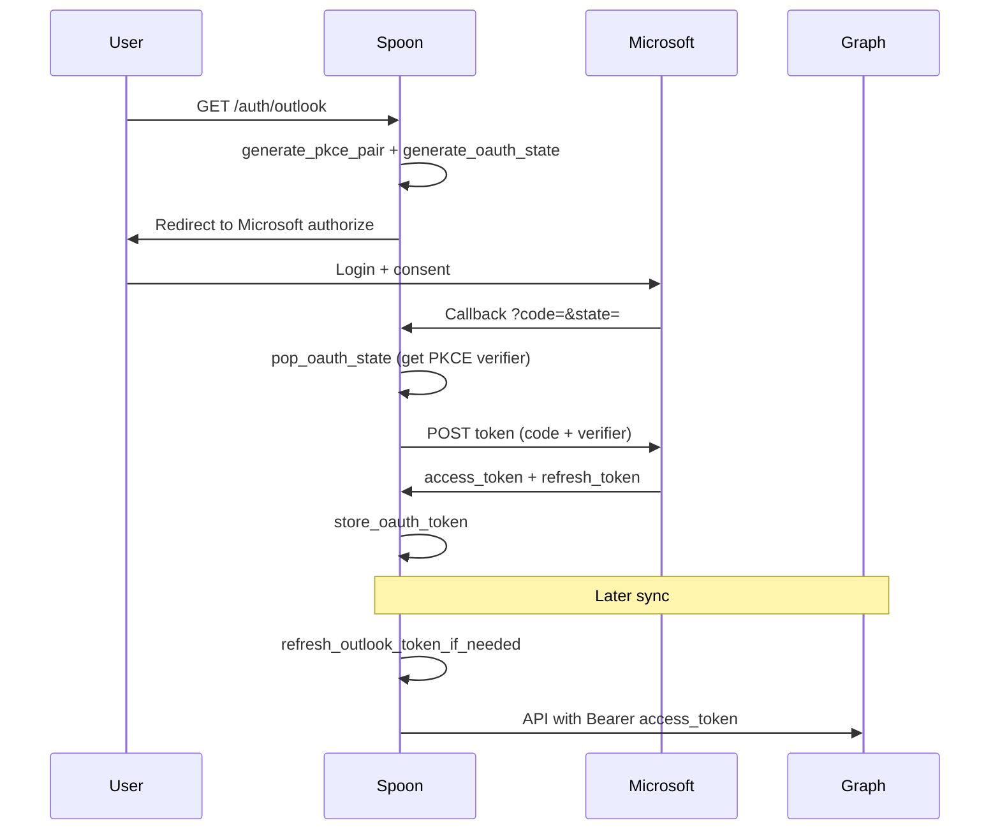

# `outlook_oauth.py` — Microsoft Outlook / Graph OAuth

`outlook_oauth.py` implements OAuth 2.0 for Microsoft identity platform (common tenant) to access Outlook mail and user profile via Microsoft Graph. It uses PKCE, refresh tokens with `offline_access`, and the same token merge/refresh patterns as Google Drive OAuth.

---

## Role in Spoon Architecture

Outlook mail sync (`app/connectors/outlook.py`) calls `refresh_outlook_token_if_needed()` before Graph API requests. Generic OAuth routes expose provider key `outlook`.

```
GET /auth/outlook ──▶ build_authorization_url() ──▶ Microsoft login
        │
GET /auth/outlook/callback ──▶ exchange_code_for_token ──▶ store_oauth_token
        │
Outlook sync ──▶ refresh_outlook_token_if_needed() ──▶ Microsoft Graph
```

Registered in `OAUTH_PROVIDERS` with message "Outlook connected successfully".

---

## Dependencies

### What this module imports

| Import | Source | Purpose |
|--------|--------|---------|
| `typing.Any` | stdlib | Type hints |
| `urlencode` | `urllib.parse` | Authorization URL query string |
| `httpx` | third-party | HTTP errors on refresh failure |
| `exchange_token_form`, `generate_oauth_state` | `app.auth.oauth` | Token POST and CSRF state |
| `generate_pkce_pair` | `app.auth.pkce` | PKCE verifier/challenge |
| `get_provider_token`, `set_provider_token` | `app.auth.store` | Token persistence |
| `merge_oauth_token`, `token_needs_refresh` | `app.auth.token_utils` | Merge and refresh timing |
| `get_settings` | `app.config` | Microsoft client credentials and redirect URI |

### What imports this module

| Consumer | Symbols used |
|----------|----------------|
| `app/auth/providers.py` | OAuth registry functions |
| `app/connectors/outlook.py` | `refresh_outlook_token_if_needed` |

---

## Line-by-Line Reference

| Lines | Code / Section | Explanation |
|-------|----------------|-------------|
| 1–10 | Imports | Standard, HTTP, Spoon auth/config modules. |
| 12–20 | Constants | Microsoft OAuth endpoints, Graph scopes, provider `"outlook"`. |
| 14–18 | `OUTLOOK_SCOPE_LIST` | `Mail.Read`, `User.Read`, `offline_access` |
| 19 | `OUTLOOK_SCOPES` | Space-joined scope string for URLs and refresh |
| 23–39 | `build_authorization_url()` | Microsoft authorize URL with PKCE. |
| 25–26 | Config guard | Raises if Outlook OAuth not configured. |
| 28 | `generate_pkce_pair()` | PKCE pair for authorization + callback. |
| 29–38 | Query params | Includes `response_mode=query` (code in query string). |
| 35 | `generate_oauth_state(pkce_verifier=verifier)` | State with stored PKCE verifier. |
| 42–55 | `exchange_code_for_token()` | Authorization code grant with optional PKCE verifier. |
| 58–67 | `refresh_access_token()` | Refresh grant; includes `scope` param (Microsoft recommendation). |
| 70–71 | `store_oauth_token()` | Uses `merge_oauth_token` without extra fields. |
| 74–78 | `get_outlook_access_token()` | Read access token from store only. |
| 81–98 | `refresh_outlook_token_if_needed()` | Refresh if expired; stale token on HTTP error. |

---

## Key Functions and Constants

| Name | Kind | Description |
|------|------|-------------|
| `OUTLOOK_AUTH_URL` | Constant | `login.microsoftonline.com/common/oauth2/v2.0/authorize` |
| `OUTLOOK_TOKEN_URL` | Constant | `login.microsoftonline.com/common/oauth2/v2.0/token` |
| `OUTLOOK_SCOPE_LIST` | Constant | Graph permission scopes |
| `PROVIDER` | Constant | Token store key `"outlook"` |
| `build_authorization_url()` | Function | Start OAuth redirect URL |
| `exchange_code_for_token()` | Async function | Code → tokens |
| `refresh_access_token()` | Async function | Refresh token → new access token |
| `store_oauth_token()` | Async function | Persist merged tokens |
| `get_outlook_access_token()` | Async function | Stored access token without refresh |
| `refresh_outlook_token_if_needed()` | Async function | Valid token for Graph API calls |

---

## Microsoft Graph Scopes

| Scope | Purpose |
|-------|---------|
| `https://graph.microsoft.com/Mail.Read` | Read user's mail messages |
| `https://graph.microsoft.com/User.Read` | Read signed-in user profile |
| `offline_access` | Receive refresh token for long-term access |

Tenant `common` in URLs allows both organizational and personal Microsoft accounts (subject to app registration settings).

---

## Design Choices & Tradeoffs

| Choice | Advantage | Drawback | Alternative |
|--------|-----------|----------|-------------|
| `/common/` tenant | Works for multi-tenant and MSA | Less control than single-tenant URL | `/organizations/` or specific tenant ID |
| PKCE + client secret | Defense in depth for confidential client | Redundant for some Microsoft app types | PKCE-only public client |
| `scope` on refresh request | Aligns with Microsoft docs | Must match granted scopes | Omit scope on refresh |
| `response_mode=query` | Standard redirect with `?code=` | — | `fragment` for SPA (not used here) |
| No static token fallback | OAuth-only (unlike Notion/Slack) | Requires full OAuth setup | Support client credentials for service mailboxes |
| Stale token on refresh error | Same pattern as gdrive/notion | Risk of 401 from Graph | Force re-auth on refresh failure |

---

## Security Considerations

- **Mail.Read** exposes email content — encrypt token store; limit API key access to Spoon server.
- **Refresh tokens** for Microsoft are long-lived — treat like passwords; support disconnect via `DELETE /auth/outlook`.
- **PKCE + state** — mitigates CSRF and intercepted authorization codes.
- **Client secret** in env — rotate in Azure portal if leaked.
- **Common endpoint** — ensure Azure app registration matches account types you intend to support (single vs multi-tenant).
- **No token logging** — Graph access tokens grant mail access.

---

## When and How to Extend

### Configure Azure AD app

1. Register app in Microsoft Entra (Azure AD).
2. Add redirect URI matching `SPOON_OUTLOOK_OAUTH_REDIRECT_URI`.
3. Grant delegated permissions: `Mail.Read`, `User.Read`, `offline_access`.
4. Create client secret.

Set environment:

- `SPOON_OUTLOOK_CONNECTION_CLIENT_ID`
- `SPOON_OUTLOOK_CONNECTION_SECRET_ID`
- `SPOON_OUTLOOK_OAUTH_REDIRECT_URI`

### Restrict to organization tenant

Replace `common` in `OUTLOOK_AUTH_URL` and `OUTLOOK_TOKEN_URL` with your tenant ID for single-tenant apps.

### Add Graph scopes (e.g. calendar)

1. Add scope to `OUTLOOK_SCOPE_LIST`.
2. Update Azure app permissions and admin consent.
3. Users re-authorize via OAuth flow.

### Add `get_outlook_access_token` usage in connector

Connector already uses `refresh_outlook_token_if_needed`; use getter only when refresh logic is bypassed.

### Handle refresh failures explicitly

Replace `return stored.get("access_token")` on `httpx.HTTPError` with `None` to force connector `is_authenticated()` false and prompt re-auth.

### Mirror pattern for new Microsoft product

Copy module structure; change scopes and provider key; register in `providers.py`.

---

## OAuth flow diagram



---

## Environment variables (via settings)

| Setting property | Purpose |
|------------------|---------|
| `outlook_connection_client_id` | Azure application (client) ID |
| `outlook_connection_secret_id` | Client secret value |
| `outlook_oauth_redirect_uri` | Registered redirect URI |
| `outlook_oauth_configured` | Computed when ID + secret present |
